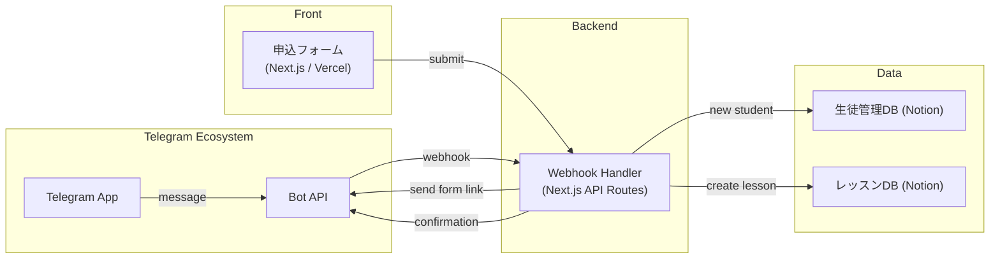

# 教育機関 × Telegram 連携システム — MVP 仕様書

## 1. 目的・スコープ

| 項目 | 内容 |
|------|------|
| **目的** | 東南アジア・CIS圏の語学学校・教育機関が Telegram を通じて問い合わせ受付・生徒管理・体験レッスン予約を自動化する仕組みを提供する |
| **対象市場** | CIS圏（ロシア、ウズベキスタン、カザフスタン）、東南アジア（ベトナム、インドネシア） |
| **対象機能（MVP）** | 1. Telegram Bot で問い合わせ受付 2. 体験レッスン申込フォーム（Next.js）への誘導 3. Notion 生徒DB・レッスンDB 登録 4. レッスンリマインダー通知 5. コース案内の自動返信 |
| **除外範囲** | オンライン授業配信、決済、成績管理 |

---

## 2. システム構成図

---

## 3. データモデル

### 3.1 生徒DB
| プロパティ | 型 | 備考 |
|------------|----|------|
| 名前 (title) | Title | 生徒名 |
| Telegram ID | Number | 主キー（chat_id） |
| Telegram ユーザー名 | Rich text | @username |
| メールアドレス | Email | |
| 電話番号 | Phone | |
| 言語 | Select | ru / en / vi / id / uz |
| 興味コース | Multi-select | 英語 / 日本語 / 中国語 / プログラミング / デザイン |
| 現在レベル | Select | beginner / intermediate / advanced |
| 受講回数 | Number | Rollup |
| ステータス | Select | 問い合わせ / 体験済 / 受講中 / 休会 / 退会 |
| 備考 | Text | |

### 3.2 レッスンDB
| プロパティ | 型 | 備考 |
|------------|----|------|
| レッスンID (title) | Title | YYYYMMDD_名前_コース |
| 生徒 | Relation → 生徒DB | |
| 日時 | Date | ISO8601 |
| コース | Select | |
| 形式 | Select | online / offline |
| 講師 | Select | |
| ステータス | Status | 予約→実施→完了→キャンセル |
| リマインダー送信済 | Checkbox | |
| フィードバック | Text | 講師メモ |

---

## 4. コンポーネント設計

### 4.1 申込フォーム (Next.js)

| ルート | 内容 |
|--------|------|
| `/` | 体験レッスン申込フォーム（多言語対応） |

### 4.2 Telegram Bot コマンド

| コマンド | 処理 |
|----------|------|
| `/start` | ウェルカムメッセージ + コース一覧 |
| `/courses` | コース詳細（インラインキーボード） |
| `/book` | 体験レッスン申込フォームリンク送信 |
| `/schedule` | 自分の予約一覧 |
| 自由テキスト | 問い合わせ意図判定 → 適切な返答 |

---

## 5. Telegram Bot API 連携

- Bot API: `https://api.telegram.org/bot{token}/`
- Webhook設定: `setWebhook` で Vercel URL を登録
- メッセージ送信: `sendMessage` with `chat_id`
- インラインキーボード: `reply_markup.inline_keyboard`
- コールバッククエリ: コース選択時の処理

---

## 6. セキュリティ

- Webhook URLにシークレットトークンを含める
- Telegram chat_id は内部IDとして管理
- Notion APIトークンは環境変数で管理
- HTTPS必須

---

## 7. 拡張性

- Google Meet / Zoom 連携（オンラインレッスンURL自動生成）
- 宿題提出（Telegram ファイル送信 → Notion添付）
- 出席管理の自動化
- 紹介プログラム（紹介コード発行）
